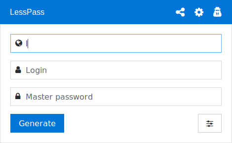

Managing your Internet passwords is not easy. You probably use a password manager to help you. The system is simple, the tool generates random passwords whenever you need them and saves them into a file protected with a strong password.

This system is very robust, you only need to remember one password to rule them all! Now you have a unique password for each site on the Internet.

I have used this system for a long time. But every time I met the same problems:

- How do I synchronize this file on all my devices ?
- How do I access a password on my parents’ computer without installing my password manager ?
- How do I access a password on my phone, without any installed app ?

So I searched for a simpler solution and as none satisfied all those criteria I created LessPass.

- I want a password manager with open source code, that does not require synchronization.

The trick is to compute passwords rather than generate and store random passwords.

LessPass generates unique passwords for websites, email accounts, or anything else based on a master password and information you know.

LessPass is different from other password managers that you can find on the Internet because:

- It can operate completely offline and without a database ;
- It does not need to sync your devices ;
- It is open source (source code can be audited).

The system uses a pure function, i.e. a function that given the same parameters will always give the same result. In our case, given a login, a master password, a site and options it will return a unique password.

No need to save your passwords in an encrypted file. You just need to access the tool to recalculate a password from information that you know (mostly the login).

To raise the cost of breaking your master password, the generation of the password must be time consuming, especially by brute force. So LessPass uses PBKDF2 with 100,000 iterations and a hash function sha-256.
Password generation is based on pure functions.

The hash generated by the first function is derived and processed in order to respect the requested options (i.e. length, lowercase, uppercase, numbers, special characters):

The source code is available [here](https://github.com/lesspass/lesspass/), I invite you to have a look .

## What does it look like?

A picture is worth a thousand words:

The simplest way to try it is to use the official website https://lesspass.com/ to type in your site, login and master password. The password will be generated on the fly so you just have to copy it (using the button or the keyboard).

Try it on your phone, on another computer, even offline, it will give the same result. No need to sync.

## Is it available on my OS/device?

Yes, as soon as you have access to a browser it’s available to you. But we went beyond that and added:

- an Android application ;
- a Chrome extension ;
- a Firefox extension ;
- a command line interface ;
- and the official site (for more security use browser extensions).

## What about complex password rules?

Sometimes sites have specific password rules. For instance, some banks only accept passwords made of numbers. So you have to remember both a strong password and complex rules.

Well, we built a "connected" version to tackle that. It works by saving your password’s profile, i.e. everything **except the master password and the generated password** to be able to generate the password. Then, next time you need this password you just have to select the profile and type the master password.

Here is what a profile looks like:

    {
        "login": "38491092",
        "site": "www.ingdirect.fr",
        "lowercase": false,
        "uppercase": false,
        "symbols": false,
        "numbers": true,
        "counter": 1,
        "length": 6
    }

Below is a user connecting to it’s account to use his bank’s account profile:
The connected version can help you save complex profiles.

Note that the use of LessPass Database is not necessary.

## Self Hosted

You can host your own LessPass Database if you do not want to use the official one. The requirement for self-hosting is to have `docker` and `docker-compose` installed on your machine.

Look at the documentation on github if you are interested in

## How do I change a password without changing my master password?

That’s the purpose of the counter field in the options field set, increment it and you will get a new password.
Counter field

## How to contribute?

- If you are a scientist, help us write a white paper ;
- Send pull requests to improve or fix the source code ;
- Rate the Firefox or the Chrome extension ;
- Send us to the stars on github ;

## Open Culture

LessPass is open source (GPLv3 license), we refuse to install cookies, analysis tools on our applications (there are no Google Analytics, or links to external services on our tools).

We host our code on Vultr’s servers and our DNS are managed by Gandi .

We really like the idea of ​​an open culture: all bugs that we find are visible.

We document our algorithms and our approach: no magic, no black box.

We love feedback and your ideas to improve the tool: we are aware of some limitations (change of master password, for example) but we are working to improve the product.

We are not sponsored by any company, developing LessPass is done during our free time.

If you have comments or questions, feel free to email us at contact@lesspass.com

I want to thank Édouard Lopez for all the work on user experience and great feadback on the product!
