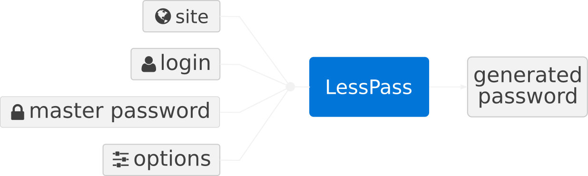
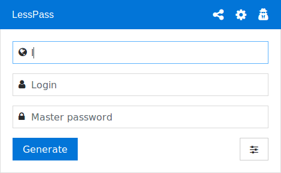

Internet Passwörter zu verwalten ist nicht leicht. Vielleicht verwenden Sie einen Passwort-Manager, der Ihnen dabei hilft. So ein System ist einfach, das Programm erstellt zufällige Passwörter, wann immer Sie sie benötigen und speichert diese in einer Datei, die mit einem starken Passwort gesichert ist.

So ein System ist sehr zuverlässig. Man muss sich nur dieses eine Passwort merken, um alle anderen zu beherrschen. Somit hat man dann je ein einzigartiges Passwort für jede Internetseite.

[Guillaume](https://blog.lesspass.com/@guillaume20100) selbst hat so ein System lange Zeit genutzt. Aber jedesmal stieß er auf dieselben Probleme:

* Wie synchronisiert er diese Datei auf all seinen Geräten?

* Wie kann er auf ein bestimmtes Passwort auf dem Computer seiner Eltern zugreifen, ohne dort seinen Passwort-Manager zu installieren?

* Wie kann er auf seinem Telefon auf ein Passwort zugreifen, ohne jegliche installierte App?

Also suchte [Guillaume](https://blog.lesspass.com/@guillaume20100) nach einer einfacheren Lösung und -weil keine alle Kriterien erfüllte- entwickelte schließlich LessPass.
> # "Ich möchte einen Passwort-Manager aus open source code, der keine Synchronisation erfordert."

Der Trick besteht darin, Passwörter zu errechnen, anstatt zufällige Passwörter zu erstellen und zu speichern.

**LessPass erstellt einzigartige Passwörter für Webseiten, email-Konten oder Sonstiges auf der Basis eines Masterpassworts und Ihnen bekannter Informationen.**

LessPass unterscheidet sich von anderen Passwort-Managern, die man im Internet finden kann, weil:

* es Ihre Passwörter nicht in einer Datenbank speichert,

* es nicht erforderlich ist, Ihre Geräte zu synchronisieren,

* es open source ist (der source code kann geprüft werden).

Das System benutzt eine reine Funktion, das heißt eine Funktion die bei gegebenen identischen Parametern immer dasselbe Ergebnis ausgibt. In unserem Fall ergibt ein *Login*, ein *Masterpasswort*, eine *Seite* und *Optionen* immer dasselbe einzigartige Passwort.

Es ist nicht erforderlich, Ihre Passwörter in einer verschlüsselten Datei zu speichern. Sie benötigen nur Zugang zu dem Tool, um das Passwort aus den Ihnen bekannten Informationen (meistens das *Login*) **wieder zu berechnen.**

Um den Aufwand zu erhöhen, Ihr Masterpasswort zu knacken, muss die Erstellung des Passworts sehr zeitintensiv sein, insbesondere bei brute force. Deswegen benutzt LessPass *PBKDF2* mit 100.000 Iterationen und der *sha-256* Hash-Funktion.

*Die Passworterstellung basiert auf reinen Funktionen.*

Der Hash, der von der ersten Funktion generiert wird, wird abgeleitet und transformiert, um die gewünschten Optionen (z.B. Länge, Klein- und Großbuchstaben, Zahlen, Sonderzeichen) zu berücksichtigen.

Der source code ist sehr übersichtlich. [Guillaume](https://blog.lesspass.com/@guillaume20100) lädt Sie ein, ihn sich anzusehen.

## Wie sieht das aus?

Ein Bild sagt mehr als tausend Worte:

Der einfachste Weg es auszuprobieren ist es, auf der **offiziellen Webseite** [**https://lesspass.com/](https://lesspass.com/)** Ihre Angaben zu *Seite, Login* und *Masterpasswort* einzugeben. Das Passwort wird on-the-fly erstellt, Sie müssen es lediglich in die Zwischenablage kopieren (mittels Schaltfläche oder Tastatur).

Probieren Sie es auf Ihrem Telefon, auf einem anderen Computer oder sogar Offline - es wird immer dasselbe Ergebnis ausgegeben. Ohne Erfordernis zu synchronisiseren.

## Gibt es das für mein Betriebssystem/Gerät?

Ja, sofern Sie Zugang zu einem Browser haben, steht es Ihnen zur Verfügung. Aber die Entwickler gingen noch weiter und fügten hinzu:

* eine [Android App](https://play.google.com/store/apps/details?id=com.lesspass.android&hl=en),

* eine [Chrome Erweiterung](https://chrome.google.com/webstore/detail/lesspass/lcmbpoclaodbgkbjafnkbbinogcbnjih),

* eine [Firefox Erweiterung](https://addons.mozilla.org/en-US/firefox/addon/lesspass/),

* eine [Befehlszeilen-Schnittstelle](https://github.com/lesspass/lesspass/tree/master/cli),

* und die [offizielle Webseite](https://lesspass.com/) (für erhöhte Sicherheit benutzen Sie die Browser-Erweiterung).

## Was ist bei komplexen Passwort-Regeln?

Manchmal haben Webseiten besondere Passwort-Regeln. Beispielsweise akzeptieren manche Banken nur Passwörter, die aus Zahlen bestehen. Dann muss man sich beides merken: ein starkes Passwort und komplexe Regeln.

Um dem zu begegnen, wurde eine* „verbundene"* Version entwickelt. Diese speichert Ihr *Passwort-Profil*, d.h. alles zur Erstellung des Passworts Erforderliche, **außer dem *Masterpasswort* und dem erstellten Passwort.** Wenn Sie das Passwort dann beim nächsten Mal benötigen, müssen Sie nur das *Profil* auswählen und das *Masterpasswort* eingeben.

So sieht ein *Profil* aus:

    {
        "login": "38491092",
        "site": "www.ingdirect.fr",
        "lowercase": false,
        "uppercase": false,
        "symbols": false,
        "numbers": true,
        "counter": 1,
        "length": 6
    }

Hier verbindet sich ein Benutzer mit seinem (LessPass-) Konto, um das Profil seines Bankkontos zu nutzen:

*Die verbundene Version hilft Ihnen, komplexe Profile zu speichern.*

## Selbst Hosten

Sie können Ihre LessPass-Datenbank selbst hosten, wenn Sie die offizielle nicht benutzen möchten. Die Voraussetzung für das Selbst-hosten ist, dass *docker* und *docker-compose* auf Ihrem Rechner installiert sind.

Schauen Sie sich die Dokumentation zu [github](https://github.com/lesspass/lesspass) an.

## Wie ändere ich ein Passwort, ohne mein Masterpasswort zu ändern?

Das ist der Zweck des *Zählers* innerhalb der Optionen. Erhöhen Sie ihn und Sie werden ein neues Passwort erhalten.

## Wie kann man mitwirken?

* Wenn Sie ein Wissenschaftler sind, helfen Sie uns ein Whitepaper zu erstellen.

* Senden Sie pull requests um den source code zu verbessern oder zu korrigieren.

* Bewerten Sie die Firefox- oder Chrome-Erweiterung.

* Senden Sie uns bei GitHub zu den Sternen.

## In Planung

* Verschlüsselung client-seitiger Profile,

* Whitepaper.

## Offene Kultur

LessPass ist open source (GPLv3 Lizenz), wir installieren keine Cookies oder Analyse-Tools in unseren Anwendungen (**es gibt keine Google Analytics oder Links zu externen Diensten in unseren Tools**).

Wir hosten unseren Code auf Vultr-Servern und unsere DNS werden von Gandi verwaltet.

Wir mögen die Idee von der Offenen Kultur wirklich: Alle Fehler, die wir finden, sind öffentlich sichtbar.

Wir dokumentieren unsere Algorithmen und unsere Vorgehensweise: keine Magie, keine Black Box.

Wir lieben Feedback und Ihre Ideen, um unser Tool zu verbessern: Wir sind uns einiger Einschränkungen bewusst (z.B. Wechsel des Masterpassworts), aber wir arbeiten daran, unser Tool zu verbessern.

Wir werden von keiner Firma unterstützt, die Entwicklung von LessPass geschieht während unserer Freizeit.

Wenn Sie Anmerkunden oder Fragen haben, senden Sie uns eine Mail an **contact@lesspass.com**

(Quelle: [englischer Artikel](https://blog.lesspass.com/lesspass-how-it-works-dde742dd18a4), mit Zustimmung des Autors angepasst und übersetzt -ohne Gewähr- von Panther2m)
