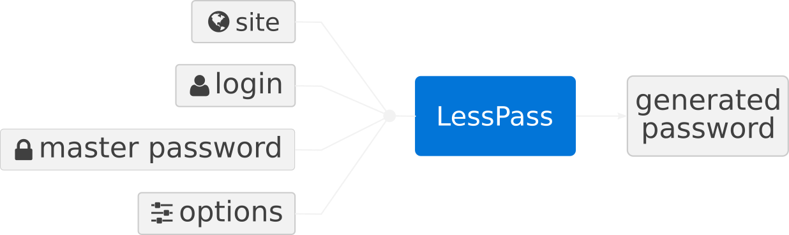
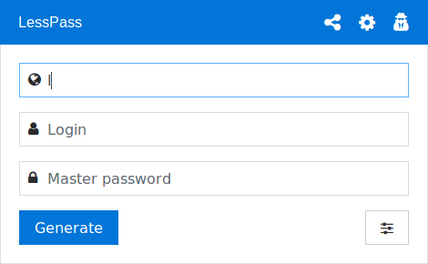
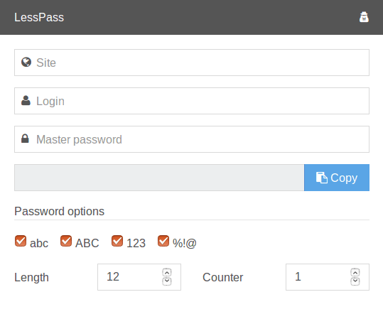

Gestire password su Internet non è semplice. Probabilmente infatti userai un password manager per questo scopo.

Il sistema è molto robusto, devi solo ricordare una singola password per gestire tutte le altre! Ti ritrovi così ad avere una password differente per ogni sito Internet.

Ho usato questo sistema per molto tempo. Ma ogni volta avevo i seguenti problemi:

* come sincronizzo questo file su tutti i miei dispositivi (quello contenente tutte le password)?

* come accedo ad una mia password sul computer dei miei genitori senza dover installare il mio password manager?

* come accedo ad una password sul mio cellulare senza nessuna app installata?

Ho cercato dunque una soluzione più semplice dato che nessuna rispettava i suddetti criteri e ho creato LessPass.
> # Voglio un password manager con codice open source che non richieda sincronizzazione alcuna

Il trucco sta nel “calcolare” piuttosto che nel generare e memorizzare password casuali.

**LessPass calcola password uniche per siti web, account di posta elettronica o qualunque altra cosa basata su una master password e un’informazione che tu conosci.**

LessPass è differente dagli altri password manager che puoi trovare su internet perché:

* Non salva le tue password in alcun database;

* Non ha bisogno di sincronizzare i tuoi dispositivi;

* è completamente open source (il codice sorgente può essere testato e verificato).

Il sistema usa una ***funzione pura*** ovvero una funzione che, dati gli stessi parametri produrrà sempre gli stessi risultati. Nel nostro caso, dato un login, una master password, un sito e delle opzioni produrrà una password unica.

Nessun bisogno di salvare le tue password in un file criptato. L’unica cosa di cui hai bisogno è avere questo strumento a disposizione per **ricalcolare** una password dai dati che conosci (fondamentalmente il login).

Al fine di alzare la difficoltà di “violazione” della tua master password, la derivazione della password deve richiedere molto tempo, soprattutto tramite metodo brute force. Dunque LessPass usa l’algoritmo **PBKDF2** con 100,000 iterazioni e una funzione di hash **sha-256**.

L’hash generato dalla prima funzione è calcolato e processato per rispettare le opzioni richieste (ad esempio minuscolo, maiuscolo, numeri e caratteri speciali):

Il codice sorgente è disponibile [qui](https://github.com/lesspass/lesspass), vi invito a dare uno sguardo.

## Come sembra in pratica?

Un’immagine vale mille parole:

La maniera più semplice di provare lo strumento è usare il sito ufficiale [https://lesspass.com/](https://lesspass.com/) per inserire sito, login e master password. La password sarà generata al volo e quindi dovrai semplicemente copiarla (usando l’apposito pulsante o la tastiera).

Provalo sul tuo cellulare, su un altro computer, anche offline, darà sempre il medesimo risultato. Nessun bisogno di sincronizzazione.

## E’ disponibile per il mio sistema operativo?

Sì, è a portata di browser. Ma siamo andati oltre a ciò e abbiamo aggiunto:

* un’[applicazione Android](https://play.google.com/store/apps/details?id=com.lesspass.android&hl=en);

* un’estensione [Chrome](https://chrome.google.com/webstore/detail/lesspass/lcmbpoclaodbgkbjafnkbbinogcbnjih);

* un’estensione [Firefox](https://addons.mozilla.org/en-US/firefox/addon/lesspass/);

* un’interfaccia a riga di comando;

* e il [sito ufficiale](https://lesspass.com/) (per maggiore sicurezza si utilizzi l’estensione).

## E per regole di password complesse?

A volte i siti hanno regole di password specifiche. Per esempio, alcune banche accettano esclusivamente password fatte di numeri. Dunque si necessita di una password efficace e di regole complesse.

A tal proposito abbiamo sviluppato una versione “***connessa***” per arginare la problematica. Il meccanismo prevede il salvataggio del profilo della password, ovvero tutto **TRANNE** la master password e la password generata- al fine di riuscire a generare correttamente la password. Dunque, la prossima volta che si avrà bisogno di quella specifica password, si sceglierà semplicemente il profilo e si inserirà la master password.

Ecco come viene rappresentato un profilo:

    {
        "login": "38491092",
        "site": "www.ingdirect.fr",
        "lowercase": false,
        "uppercase": false,
        "symbols": false,
        "numbers": true,
        "counter": 1,
        "length": 6
    }

Qui sotto è illustrato un utente che sta ricavando la password del suo conto in banca:

## Self Hosting

C’è anche la possibilità di effettuare l’hosting del proprio database LessPass se non si vuole usare quello ufficiale. L’unico requisito è l’installazione di **docker** e **docker_compose** sulla propria macchina.

Si dia uno sguardo alla documentazione su github se interessati.

## Cambiare una password senza cambiare la master password?

A questo serve esattamente il campo **counter** nella lista delle opzioni, incrementarlo porterà alla generazione di una nuova password.

## Come contribuire

* Se sei un esperto/specialista, aiutaci a scrivere un white paper;

* Invia pull requests per migliorare o correggere il [codice sorgente](https://github.com/lesspass/lesspass);

* Vota le estensioni di [Firefox](https://addons.mozilla.org/en-US/firefox/addon/lesspass/) o di [Chrome](https://chrome.google.com/webstore/detail/lesspass/lcmbpoclaodbgkbjafnkbbinogcbnjih);

* Mandaci sulle [stelle su github](https://github.com/lesspass/lesspass).

## Cultura Aperta

LessPass è open source (licenza GPLv3), ci rifiutiamo di installare cookies o strumenti di analisi sulle nostre applicazioni (**niente Google Analytics, o link a servizi esterni nei nostri strumenti**).

L’hosting dei nostri server è su [Vultr](http://www.vultr.com/?ref=6830452) e i nostri DNS sono gestiti da [Gandi](https://www.gandi.net/).

Ci piace molto l’idea di una cultura aperta: tutti i bug che troviamo sono visibili.

Documentiamo i nostri algoritmi e il nostro approccio: nessuna magia, nessuna scatola nera.

Apprezziamo le tue idee e il tuo feedback per migliorare lo strumento: siamo consci di alcune limitazioni (cambio della master password, ad esempio), ma stiamo lavorando per migliorare il prodotto.

Non abbiamo nessuna azienda come sponsor, lo sviluppo di LessPass avviene durante il nostro tempo libero.

In caso di commenti o domande, sentiti libero di contattarci via email al seguente indirizzo: [contact@lesspass.com](mailto:contact@lesspass.com)

Vorrei ringraziare [Édouard Lopez](https://twitter.com/edouard_lopez) per tutto il lavoro sull’esperienza utente e il grande feedback sul prodotto!
